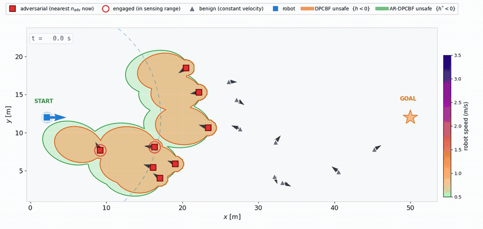
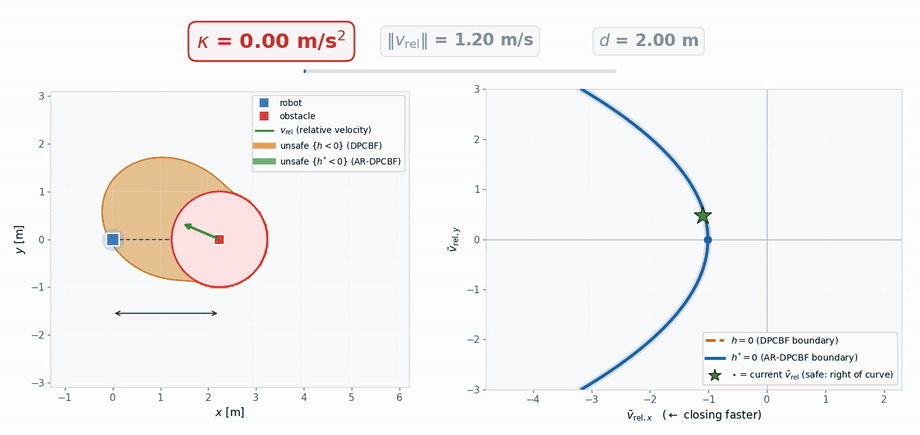
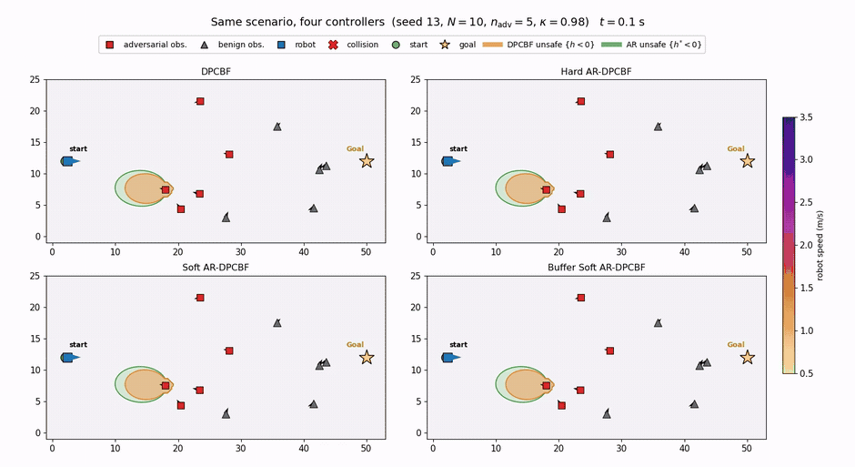

<div align='center'>
<h2 align="center"> AR-DPCBF: Adversarial-Robust Dynamic Parabolic Control Barrier Functions </h2>

**Safe navigation for nonholonomic robots against *maneuvering* obstacles.**

Reference implementation for the paper *"Adversarial-Robust Dynamic Parabolic Control Barrier
Functions for Nonholonomic Robots Against Maneuvering Obstacles."*

<a href="https://sayands.github.io/">Chandan Kumar Sah</a><sup>1</sup>, <a href="https://miksik.co.uk/">Bazeela Banday</a><sup>2</sup>, <a href="https://people.inf.ethz.ch/marc.pollefeys/">Jishnu Keshavan</a><sup>1,2</sup>, <a href="https://www.linkedin.com/in/d%C3%A1niel-bar%C3%A1th-3a489092/">


<p align="center">
  
</p>

<p align="center">
  <em>Same scenario, four controllers. DPCBF's QP reports its barrier satisfied the whole time — and the
  robot still hits an obstacle. The three AR-DPCBF variants route around the same threat and reach the goal.</em>
</p>
</div>

## 📃 Abstract

Adversarial-Robust Dynamic Parabolic Control Barrier Functions (AR-DPCBF) extend Dynamic Parabolic Control Barrier Functions (DPCBFs) to dynamic environments with maneuvering obstacles. Unlike DPCBF, which assumes constant obstacle velocity, AR-DPCBF models obstacle maneuvers through a bounded-adversary framework and derives a geometry-preserving robust safety certificate with formal guarantees. The proposed approach introduces Adversarial Control Barrier Functions (A-CBFs), closed-form parameter contractions, explicit feasibility conditions, and an online obstacle capability estimator. Two soft-constrained variants further improve feasibility in cluttered environments while retaining nominal DPCBF safety. Extensive simulations demonstrate significant reductions in barrier violations and collisions compared with DPCBF, with Buffer Soft AR-DPCBF providing the best overall trade-off between safety, feasibility, and robustness.

## News :newspaper:
* **1. June 2026**: [SGAligner preprint](https://arxiv.org/abs/2304.14880v1) released on arXiv.
* **10. April 2023**: Code released.

<!-- TABLE OF CONTENTS -->
<details open="open" style='padding: 10px; border-radius:5px 30px 30px 5px; border-style: solid; border-width: 1px;'>
  <summary>Table of Contents</summary>
  <ol>
  <li>
      <a href="#motivation">Motivation</a>
    </li>
    <li>
      <a href="#key-contributions">Key contributions</a>
    </li>
    <li>
      <a href="#method-overview">Method overview</a>
    </li>
    <li>
      <a href="#installation">Installation</a>
    </li>
    <li>
      <a href="#repository-structure">Repository Structure</a>
    </li>
    <li>
      <a href="#citation">Citation</a>
    </li>
  </ol>
</details>

## Motivation

Control Barrier Functions certify safety by enforcing `ḣ ≥ −α(h)` in a QP. The Dynamic Parabolic CBF
(DPCBF) does this elegantly for dynamic obstacles: it replaces the conservative collision cone with a
state-dependent parabola in the line-of-sight (LoS) velocity frame, recovering feasibility in clutter
where cone-based methods have none.

But DPCBF — like every existing CBF for dynamic obstacle avoidance — evaluates its Lie derivative
assuming the obstacle **holds constant velocity**. If the obstacle accelerates or turns, the true
derivative picks up an uncompensated term:

```
[ḣ]_true = [ḣ]_DPCBF + Δ(t)
Δ(t) = a_obs·cos θ̃_obs + v_obs·ω_obs·( 2λ ṽ_rel,y cos θ̃_obs − sin θ̃_obs )
```

When `Δ(t) < 0`, the CBF condition can be satisfied by the QP **while being violated in reality**.
There is no infeasibility, no warning — the safety guarantee simply **fails silently**, and the first
symptom is a collision. This repository formalises that failure mode and fixes it.


## Key contributions

1. A **new barrier-validity notion** for safety against bounded maneuvering obstacles.
2. A **geometry-preserving adversarial extension** of DPCBF with a closed-form safety certificate.
3. **Provable safety guarantees** and feasibility conditions.
4. **Two soft variants: Soft AR-DPCBF and Buffer AR-DPCBF** for better feasibility in dense scenes.
5. **An online capability estimator** with sub-Gaussian coverage guarantees.


## Method overview

The obstacle is modelled as a bounded adversary with capability set
`F = { |a_obs| ≤ a_obs,max , |ω_obs| ≤ ω_obs,max }`, summarised by a single scalar:

```
κ := a_obs,max + v_obs,max · ω_obs,max        [m/s²]
```

AR-DPCBF **contracts** the DPCBF parabola by subtracting a worst-case maneuver budget from *both*
gains (Theorem 2):

```
DPCBF     h  = ṽ_rel,x + λ  ṽ_rel,y² + μ        λ  = k_λ d/‖v_rel‖              μ  = k_μ d
AR-DPCBF  h* = ṽ_rel,x + λ* ṽ_rel,y² + μ*       λ* = λ − κ/(γ a_max ‖v_rel‖)    μ* = μ − κ d/(γ ‖v_rel‖)
```

<p align="center">
  
</p>

<p align="center">
  <em><b>Left:</b> the true unsafe sets over robot positions — orange <code>{h&lt;0}</code> (DPCBF) always lies
  <em>inside</em> green <code>{h*&lt;0}</code> (AR-DPCBF). <b>Right:</b> the same objects in the LoS velocity frame.
  Since λ* ≤ λ and μ* ≤ μ, the AR boundary sits to the <b>right</b> of DPCBF's: the safe set shrinks as the
  obstacle grows more capable, and recovers DPCBF <b>exactly</b> at κ = 0.</em>
</p>

**Why subtract rather than add?** Contraction is what makes the certificate self-contained:
`{h* ≥ 0} ⊆ {h ≥ 0}`, so defending `h*` *inherits* DPCBF's clearance property (Proposition 3). Adding
the correction would enlarge the safe set and break the inclusion — robustness would then rest
entirely on the runtime margin.

### The four controllers

| controller | hard constraint | objective penalty | feasibility |
|---|---|---|---|
| **DPCBF** (baseline) | `h ≥ 0` | — | full |
| **Hard AR** | `h* ≥ 0` | — | **reduced** when `κ > 0` |
| **Soft AR** | `h ≥ 0` | `ρ · max(0, −h*)²` | full |
| **Buffer Soft AR** | `h ≥ 0` | `ρ · φ(h*; ε)` — Huber buffer | full |

The Huber buffer `φ` is the decisive refinement. The plain soft penalty has **zero gradient** while
`h* > 0`: the solver gets no steering signal until the adversarial boundary has *already* been
breached. The buffer supplies a non-zero gradient in the band `0 < h* ≤ ε`, steering the robot away
**before** the boundary is crossed.


## Results

### 1. DPCBF vs. AR-DPCBF variants: Under Identical Initial Conditions

<p align="center">
  
</p>

**Comparison under identical initial conditions**. All controllers are evaluated in the same dynamic obstacle scenario with identical robot and obstacle initial states. DPCBF collides because its safety certificate assumes constant obstacle velocity, whereas AR-DPCBF and its soft variants explicitly account for bounded obstacle maneuvers and safely reach the goal.

### 2. Abalation Study

<table align="center">
<tr>
<td align="center" width="50%">

<b>Silent Failure of DPCBF</b>


</td>

<td align="center" width="50%">

<b>Buffer Soft AR-DPCBF</b>


</td>
</tr>
</table>

Adversary-count sweep at `N = 15` (95% bootstrap CIs). DPCBF's **barrier-violation rate** climbs to
**95%** and its collision rate to **60%**, while all AR variants stay low. The wide gap between the
violation and collision curves is itself the signature of *silent* failure: the certificate is
breached far more often than contact actually occurs.

Pooled over six dense conditions (120 paired trials, exact McNemar test):

| metric | DPCBF | Hard AR | Soft AR | Buffer Soft AR |
|---|---|---|---|---|
| barrier violation | 84% | 46% | 29% | **25%** |
| collision | 49% | 35% | 24% | **21%** |

Buffer Soft AR-DPCBF is the only variant that significantly improves on **both** DPCBF and Hard AR on
**both** axes (`p < 10⁻³`).

### 3. Ablation on three deterministic cases

Each row is a single seed; all four controllers face the *identical* obstacle field
(clearance at closest approach in parentheses — negative means collision):

| seed | DPCBF | Hard AR | Soft AR | Buffer Soft AR | what it isolates |
|---|---|---|---|---|---|
| **13** | ✗ (−0.92 m) | ✓ (+0.61) | ✓ (+0.52) | ✓ (+0.93) | the adversarial barrier alone fixes DPCBF |
| **17** | ✗ (−0.75) | ✗ (−0.71) | ✓ (+0.64) | ✓ (+0.91) | soft penalties add what hard enforcement cannot |
| **7** | ✗ (−0.71) | ✗ (−0.85) | ✗ (−0.39) | ✓ (**+1.02**) | the proactive buffer is decisive in the hardest case |

<p align="center">
  
</p>
<p align="center"><em>Seed 7 — DPCBF, Hard AR and Soft AR all collide; only Buffer Soft AR-DPCBF gets through.</em></p>

### 4. Feasibility — why the soft variants exist

<p align="center"></p>

Hard AR-DPCBF's QP-infeasibility rate rises with density (→ ~4.9% at `N = 30`) while Soft (~0.8%) and
Buffer (~0.3%) stay flat near zero — the empirical signature of Propositions 11–12. Note the soft
variants sit *below* DPCBF: Props 11–12 guarantee equality of the feasible set **at a given state**,
and because the penalties steer proactively, the robot simply *visits* near-infeasible pockets less
often.

### 5. The main theorem holds

<p align="center"></p>

The Nagumo condition `sup_u inf_F ḣ* ≥ 0` tested at sampled boundary states `{h* = 0}` across the
`(κ, c_min)` plane. **The entire region certified by Theorem 9 (`c_min > κ`, above the dashed line) is
100% maintainable — zero counterexamples.** The empirical cliff lies *beyond* the line and the
transition is graceful: the theorem is sound and mildly conservative, exactly as a sufficient
condition should be.

### 6. It fails safe

<p align="center"></p>

The controller assumes `κ = 0.98` while the obstacle's *true* capability is swept. Buffer Soft
AR-DPCBF holds violations near 13% even when the obstacle is **twice as capable as assumed** — a
graceful degradation with no cliff. Over-provisioning (`κ_true < κ_assumed`) is conservative but
*safer* than a matched controller.

### 7. The price of robustness

| | path length | time-to-goal | median QP cost | collisions |
|---|---|---|---|---|
| DPCBF | 50.1 m | 20.6 s | **78** (highest) | 42% |
| Buffer Soft AR | 53.6 m (+7%) | 21.8 s (+6%) | 47 | **8%** |

Robustness costs a ~7% path detour — but *reduces* median control effort. DPCBF is the **most**
effortful of the four, because under a maneuvering adversary it reacts late and violently, and the
squared cost punishes those spikes.

### 8. A negative result, kept on the record

A symmetric **all-sides encirclement** does *not* separate DPCBF from the soft variants: below a
capability threshold every controller escapes; above it every controller collides — and the more
conservative variants can be *trapped* and do **worse**. AR-DPCBF's advantage is keeping margin *when
there is room to route around a threat*; a closing ring removes that room, and tends toward an
inevitable-collision state. See [`docs/notes_encirclement.md`](docs/notes_encirclement.md) and
`experiments/encirclement_probe.py`.

---

## Installation

```bash
git clone https://github.com/<user>/ar-dpcbf.git
cd ar-dpcbf
pip install -r requirements.txt        # numpy, matplotlib
# ffmpeg is needed only for the .mp4 animation scripts
```

There is **no solver dependency**: the 2-D QP is solved exactly by KKT / vertex enumeration in
`ardpcbf_core.py`.

---

## Reproducing the paper

Figures that re-simulate on the fly (no data step needed):

```bash
python figures/plot_silent_case.py             # the silent-failure contrast
python figures/plot_variation.py               # parabola contraction
python figures/plot_t0.py                      # scenario initial condition
python figures/plot_timelapse.py buffer 57     # navigation timelapse (any method/seed)
python figures/animate_compare.py 13           # 2x2 four-controller MP4
python figures/animate_variation.py            # 30 s parameter-sweep MP4
```

Experiments (write `data/*.npz`), then their plotters:

```bash
python experiments/run_adversary_sweep.py 40  && python figures/plot_adversary_sweep.py
python experiments/run_core_sweeps.py all 40  && python figures/plot_core_sweeps.py all
python experiments/validity_boundary.py       && python figures/plot_boundary.py

bash run_all.sh                                # all of the above
```

### Determinism

Every scenario is a pure function of an integer seed:

```python
from scenario import make_scn
scn = make_scn(seed=13, N=10, n_adv=5)   # the n_adv obstacles CLOSEST to the robot's
                                         # start are designated the adversaries
```

### Parameters

`class P` in `ardpcbf/ardpcbf_core.py` holds the DPCBF Table I values — `ℓ_r = 0.20`,
`a_max = 5.0`, `β_max = 0.28`, `v_max = 3.5`, `v_des = 2.5`, `r = 1.0`, sensing radius `15` —
plus the three AR-specific settings, disclosed explicitly:

- `v_min = 1.0` — steering authority scales as `v²/ℓ_r` and vanishes at rest, so a positive floor is
  required to defend the barrier. This gives `c_min = min{a_max, v_min² β_max/ℓ_r} = 1.40`.
- `γ = 3.0` — the pre-emption gain (fraction of the worst-case maneuver reserved in the parameters).
- `ρ = 10.0`, `ε = 0.3` — soft-penalty weight and Huber buffer width.

### Metrics

Three axes, deliberately **not** conflated:

- **barrier violation** — `min_t h < 0`, the silent-failure event (**primary metric**)
- **collision** — `d < r`, its downstream consequence
- **QP infeasibility** — per-cycle rate at which the safety program admits no input

## Repository Structure

```text
Adversarial-DPCBF/
├── ardpcbf/                         # Core AR-DPCBF implementation
│   ├── ardpcbf_core.py              # AR-DPCBF safety filter and QP formulation
│   ├── ardpcbf_estimator.py         # Online obstacle capability estimation
│   ├── ardpcbf_run.py               # Main simulation pipeline
│   ├── scenario.py                  # Dynamic obstacle scenario generation
│   └── _barrier_grid.py             # Barrier evaluation utilities
│
├── experiments/                     # Scripts to reproduce paper experiments
│   ├── run_core_sweeps.py           # Capability and density sweeps
│   ├── run_adversary_sweep.py       # Adversarial capability experiments
│   ├── validity_boundary.py         # Feasibility boundary evaluation
│   └── encirclement_probe.py        # Encirclement analysis
│
├── figures/                         # Figure generation and animations
│   ├── animate_compare.py           # Comparison animations
│   ├── animate_timelapse.py         # Time-lapse animations
│   ├── animate_variation.py         # Dynamic adversary visualization
│   ├── plot_core_sweeps.py          # Main experimental figures
│   ├── plot_adversary_sweep.py
│   ├── plot_boundary.py
│   ├── plot_silent_case.py
│   ├── plot_timelapse.py
│   └── plot_variation.py
│
├── results/                         # Reproduced figures from the paper
│   ├── *.pdf
│   └── *.png
```

All figure PDFs embed editable TrueType fonts (`pdf.fonttype = 42`) and open as **editable vector
art** in Illustrator. See [`docs/figure_index.md`](docs/figure_index.md) for the exact script → figure
mapping.

---

## Citation

```bibtex
@article{ardpcbf2026,
  title   = {Adversarial-Robust Dynamic Parabolic Control Barrier Functions for
             Nonholonomic Robots Against Maneuvering Obstacles},
  author  = {<authors>},
  journal = {<venue>},
  year    = {2026}
}
```

Built on the DPCBF framework:

```bibtex
@inproceedings{park2026dpcbf,
  title     = {Beyond Collision Cones: Dynamic Obstacle Avoidance for Nonholonomic
               Robots via Dynamic Parabolic Control Barrier Functions},
  author    = {Park, H. K. and Kim, T. and Panagou, D.},
  booktitle = {IEEE Int. Conf. on Robotics and Automation (ICRA)},
  year      = {2026}
}
```

## License

MIT — see [LICENSE](LICENSE).
