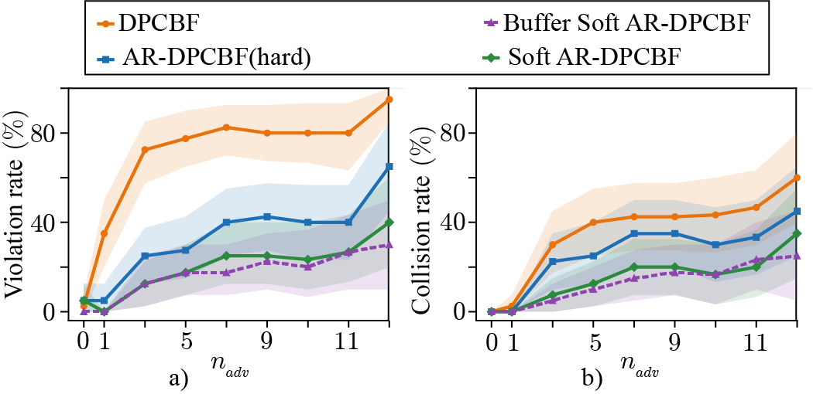
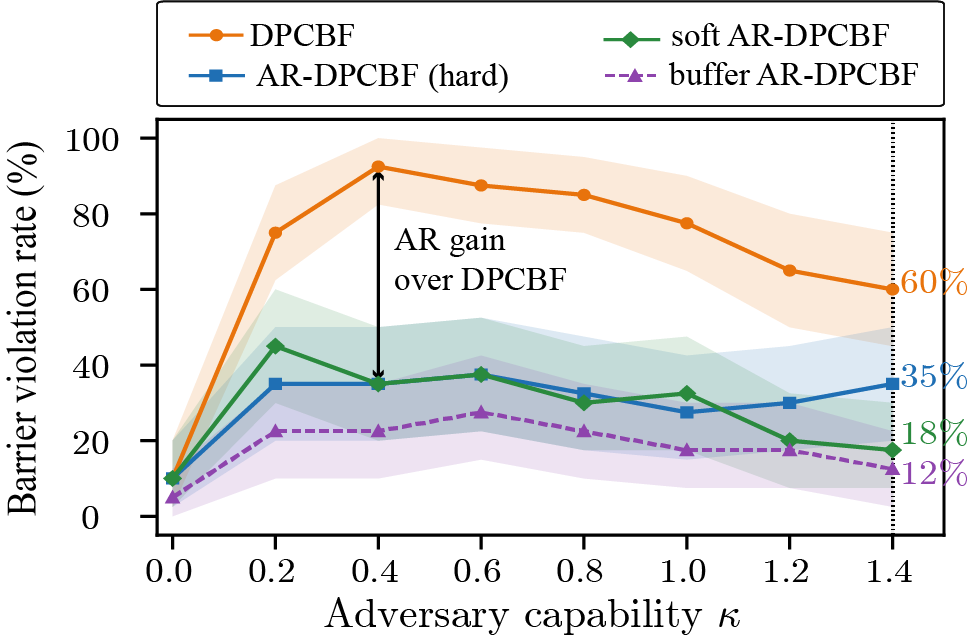

<div align='center'>
<h2 align="center"> AR-DPCBF: Adversarial-Robust Dynamic Parabolic Control Barrier Functions for Nonholonomic Robots Against Maneuvering Obstacles</h2>

**Safe navigation for nonholonomic robots against *maneuvering* obstacles.**

<a href="mailto:chandanks@iisc.ac.in">Chandan Kumar Sah</a>,
<a href="mailto:bazeelab@iisc.ac.in">Bazeela Banday</a>,
<a href="mailto:kjishnu@iisc.ac.in">Jishnu Keshavan</a>

<h3 align="center"> DACAS Lab, Indian Institute of Science, Bangalore</h3>

[](...)
[](https://cks0314.github.io/dummy_page/)
[](#videos)
[](LICENSE)
 <div align="center"></div>

<p align="center">
  
</p>

<p align="center">
  <em>Buffer Soft AR-DPCBF navigating 16 dynamic obstacles, out of which 8 are maneuvering adversaries</em>
</p>
</div>

## 📃 Abstract

Adversarial-Robust Dynamic Parabolic Control Barrier Functions (AR-DPCBF) extend Dynamic Parabolic Control Barrier Functions (DPCBFs) to dynamic environments with maneuvering obstacles. Unlike DPCBF, which assumes constant obstacle velocity, AR-DPCBF models obstacle maneuvers through a bounded-adversary framework and derives a geometry-preserving robust safety certificate with formal guarantees. The proposed approach introduces Adversarial Control Barrier Functions (A-CBFs), closed-form parameter contractions, explicit feasibility conditions, and an online obstacle capability estimator. Two soft-constrained variants further improve feasibility in cluttered environments while retaining nominal DPCBF safety. Extensive simulations demonstrate significant reductions in barrier violations and collisions compared with DPCBF, with Buffer Soft AR-DPCBF providing the best overall trade-off between safety, feasibility, and robustness.

## News :newspaper:
* **11. July 2026**: [AR-DPCBF preprint](https://arxiv.org/abs/2304.14880v1) released on arXiv.
* **11. July 2026**: Code released.

<!-- TABLE OF CONTENTS -->
<details open="open" style='padding: 10px; border-radius:5px 30px 30px 5px; border-style: solid; border-width: 1px;'>
  <summary>Table of Contents</summary>
  <ol>
  <li>
      <a href="#motivation">Motivation</a>
    </li>
    <li>
      <a href="#key-contributions">Key contributions</a>
    </li>
    <li>
      <a href="#method-overview">Method overview</a>
    </li>
    <li>
      <a href="#results">Results</a>
    </li>
    <li>
      <a href="#installation">Installation</a>
    </li>
    <li>
      <a href="#repository-structure">Repository Structure</a>
    </li>
    <li>
      <a href="#citation">Citation</a>
    </li>
  </ol>
</details>

## Motivation

Control Barrier Functions certify safety by enforcing `ḣ ≥ −α(h)` in a QP. The Dynamic Parabolic CBF
(DPCBF) does this elegantly for dynamic obstacles: it replaces the conservative collision cone with a
state-dependent parabola in the line-of-sight (LoS) velocity frame, recovering feasibility in clutter
where cone-based methods have none.

But DPCBF evaluates its Lie derivative assuming the obstacle **holds constant velocity**. If the obstacle accelerates or turns, the true
derivative picks up an uncompensated term:

```
[ḣ]_true = [ḣ]_DPCBF + Δ(t)
Δ(t) = a_obs·cos θ̃_obs + v_obs·ω_obs·( 2λ ṽ_rel,y cos θ̃_obs − sin θ̃_obs )
```

When `Δ(t) < 0`, the CBF condition can be satisfied by the QP **while being violated in reality**.
There is no infeasibility, no warning, the safety guarantee simply **fails silently**, and the first
symptom is a collision. This repository formalizes that failure mode and fixes it.


## Key contributions

1. A **new barrier-validity notion** for safety against bounded maneuvering obstacles.
2. A **geometry-preserving adversarial extension** of DPCBF with a closed-form safety certificate.
3. **Provable safety guarantees** and feasibility conditions.
4. **Two soft variants: Soft AR-DPCBF and Buffer AR-DPCBF** for better feasibility in dense scenes.
5. **An online capability estimator** with sub-Gaussian coverage guarantees.


## Method overview

The obstacle is modelled as a bounded adversary with a capability set
`F = { |a_obs| ≤ a_obs,max , |ω_obs| ≤ ω_obs,max }`, summarised by a single scalar:

```
κ := a_obs,max + v_obs,max · ω_obs,max        [m/s²]
```

AR-DPCBF **contracts** the DPCBF parabola by subtracting a worst-case maneuver budget from *both*
gains (Theorem 2):

```
DPCBF     h  = ṽ_rel,x + λ  ṽ_rel,y² + μ        λ  = k_λ d/‖v_rel‖              μ  = k_μ d
AR-DPCBF  h* = ṽ_rel,x + λ* ṽ_rel,y² + μ*       λ* = λ − κ/(γ a_max ‖v_rel‖)    μ* = μ − κ d/(γ ‖v_rel‖)
```

<p align="center">
  
</p>

<p align="center">
  <em><b>Left:</b> the true unsafe sets over robot positions — orange <code>{h&lt;0}</code> (DPCBF) always lies
  <em>inside</em> green <code>{h*&lt;0}</code> (AR-DPCBF). <b>Right:</b> the same objects in the LoS velocity frame.
  Since λ* ≤ λ and μ* ≤ μ, the AR boundary sits to the <b>right</b> of DPCBF's: the safe set shrinks as the
  obstacle grows more capable, and recovers DPCBF <b>exactly</b> at κ = 0.</em>
</p>

### The four controllers

| controller | hard constraint | objective penalty | feasibility |
|---|---|---|---|
| **DPCBF** (baseline) | `h ≥ 0` | — | full |
| **Hard AR** | `h* ≥ 0` | — | **reduced** when `κ > 0` |
| **Soft AR** | `h ≥ 0` | `ρ · max(0, −h*)²` | full |
| **Buffer Soft AR** | `h ≥ 0` | `ρ · φ(h*; ε)` — Huber buffer | full |


## Results

### 1. DPCBF vs. AR-DPCBF variants: Under Identical Initial Conditions

<p align="center">
  
</p>

**Comparison under identical initial conditions**. All controllers are evaluated in the same dynamic obstacle scenario with identical robot and obstacle initial states. DPCBF collides because its safety certificate assumes constant obstacle velocity, whereas AR-DPCBF and its soft variants explicitly account for bounded obstacle maneuvers and safely reach the goal.

### 2. Quantitative Results

<table align="center">
<tr>

<td align="center" width="50%">

<b>Performance under Increasing Adversarial Density</b><br><br>

<br><br>

<p align="justify">
As more obstacles execute adversarial maneuvers, the nominal DPCBF rapidly degrades, exhibiting high barrier violation and collision rates. Buffer Soft AR-DPCBF consistently achieves the lowest violation and collision rates across all adversarial densities.
</p>

</td>

<td align="center" width="50%">

<b>Robustness to Increasing Obstacle Capability</b><br><br>

<br><br>

<p align="justify">
As obstacle maneuverability increases, the barrier violation rate of DPCBF rises sharply due to its constant-velocity assumption. AR-DPCBF substantially reduces violations, with Buffer Soft AR-DPCBF providing the strongest robustness across the entire capability range.
</p>

</td>

</tr>
</table>


## Installation

```bash
git clone https://github.com/<user>/ar-dpcbf.git
cd ar-dpcbf
pip install -r requirements.txt        # numpy, matplotlib
# ffmpeg is needed only for the .mp4 animation scripts
```

There is **no solver dependency**: the 2-D QP is solved exactly by KKT / vertex enumeration in
`ardpcbf_core.py`.

---

## Repository Structure

```text
Adversarial-DPCBF/
├── ardpcbf/                         # Core AR-DPCBF implementation
│   ├── ardpcbf_core.py              # AR-DPCBF safety filter and QP formulation
│   ├── ardpcbf_estimator.py         # Online obstacle capability estimation
│   ├── ardpcbf_run.py               # Main simulation pipeline
│   ├── scenario.py                  # Dynamic obstacle scenario generation
│   └── barrier_grid.py             # Barrier evaluation utilities
│
├── experiments/                     # Scripts to reproduce paper experiments
│   ├── run_core_sweeps.py           # Capability and density sweeps
│   ├── run_adversary_sweep.py       # Adversarial capability experiments
│   ├── validity_boundary.py         # Feasibility boundary evaluation
│   └── encirclement_probe.py        # Encirclement analysis
│
├── figures/                         # Figure generation and animations
│   ├── animate_compare.py           # Comparison animations
│   ├── animate_timelapse.py         # Time-lapse animations
│   ├── animate_variation.py         # Dynamic adversary visualization
│   ├── plot_core_sweeps.py          # Main experimental figures
│   ├── plot_adversary_sweep.py
│   ├── plot_boundary.py
│   ├── plot_silent_case.py
│   ├── plot_timelapse.py
│   └── plot_variation.py
│
├── results/                         # Reproduced figures from the paper
│   ├── *.pdf
│   └── *.png
```

All figure PDFs embed editable TrueType fonts (`pdf.fonttype = 42`) and open as **editable vector
art** in Illustrator. See [`docs/figure_index.md`](docs/figure_index.md) for the exact script → figure
mapping.

---

## Citation

```bibtex
@article{ardpcbf2026,
  title   = {Adversarial-Robust Dynamic Parabolic Control Barrier Functions for
             Nonholonomic Robots Against Maneuvering Obstacles},
  author  = {<authors>},
  journal = {<venue>},
  year    = {2026}
}
```

Built on the DPCBF framework:

```bibtex
@inproceedings{park2026dpcbf,
  title     = {Beyond Collision Cones: Dynamic Obstacle Avoidance for Nonholonomic
               Robots via Dynamic Parabolic Control Barrier Functions},
  author    = {Park, H. K. and Kim, T. and Panagou, D.},
  booktitle = {IEEE Int. Conf. on Robotics and Automation (ICRA)},
  year      = {2026}
}
```

## License

MIT — see [LICENSE](LICENSE).
